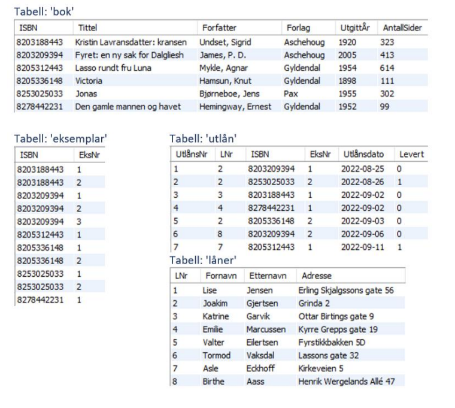

#

---
Prompt: 

> 

Extract the data from this image, please.

---
## Answer: 

Of course. Here is the data from the image, extracted and organized into three separate tables.

### Table: 'bok' (Book)

| ISBN       | Title                                      | Forfatter        | Forlag    | UtgittÅr | AntallSider |
|------------|--------------------------------------------|------------------|-----------|-----------|-------------|
| 8203188443 | Kristin Lavransdatter: Iransen            | Undset, Sigrid   | Aschehoug | 1920      | 323         |
| 8203209394 | Fyret: en ny sak for Dalglesh             | James, P. D.     | Aschehoug | 2005      | 413         |
| 8205312443 | Lasso rundt fru Luna                      | Mykle, Agnar     | Gyldendal | 1954      | 614         |
| 8205336148 | Victoria                                  | Hamsun, Knut     | Gyldendal | 1898      | 111         |
| 8253025033 | Jonas                                     | Bjørneboe, Jens  | Pax       | 1955      | 302         |
| 8278442231 | Den gamle mannen og havet                 | Hemingway, Ernest| Gyldendal | 1952      | 99          |

### Table: 'eksemplar' (Copy)

| ISBN       | EksNr |
|------------|-------|
| 8203188443 | 1     |
| 8203188443 | 2     |
| 8203209394 | 1     |
| 8203209394 | 2     |
| 8203209394 | 3     |
| 8205312443 | 1     |
| 8205336148 | 1     |
| 8205336148 | 2     |

### Table: 'utlån' (Loan)

| UtlånsNr | LNr | ISBN       | EksNr | Utlånsdata | Levert |
|----------|-----|------------|-------|------------|--------|
| 1        | 2   | 8203209394 | 1     | 2022-08-25 | 0      |
| 2        | 2   | 8253025033 | 2     | 2022-08-26 | 1      |
| 3        | 3   | 8203188443 | 1     | 2022-09-02 | 0      |
| 4        | 4   | 8278442231 | 1     | 2022-09-02 | 0      |
| 5        | 2   | 8205336148 | 2     | 2022-09-03 | 0      |
| 6        | 8   | 8203209394 | 2     | 2022-09-06 | 0      |
| 7        | 7   | 8205312443 | 1     | 2022-09-11 | 1      |

### Table: 'låner' (Borrower)

| LNr | Fornavn | Etternavn | Adresse                   |
|-----|---------|-----------|---------------------------|
| 1   | Lise    | Jensen    | Erling Skjalgssons gate 56|
| 2   | Joakim  | Gjertsen  | Grinda 2                  |
| 3   | Katrine | Garvik    | Ottar Birtings gate 9     |
| 4   | Emile   | Marcussen | Kyrre Grepps gate 19      |
| 5   | Valter  | Eilertsen | Fyrstikkbakken 50         |
| 6   | Tormod  | Vaksdal   | Lassons gate 32           |
| 7   | Asle    | Eckhoff   | Kirkeveien 5              |
| 8   | Birthe  | Aass      | Henrik Wergelands Alle 47 |